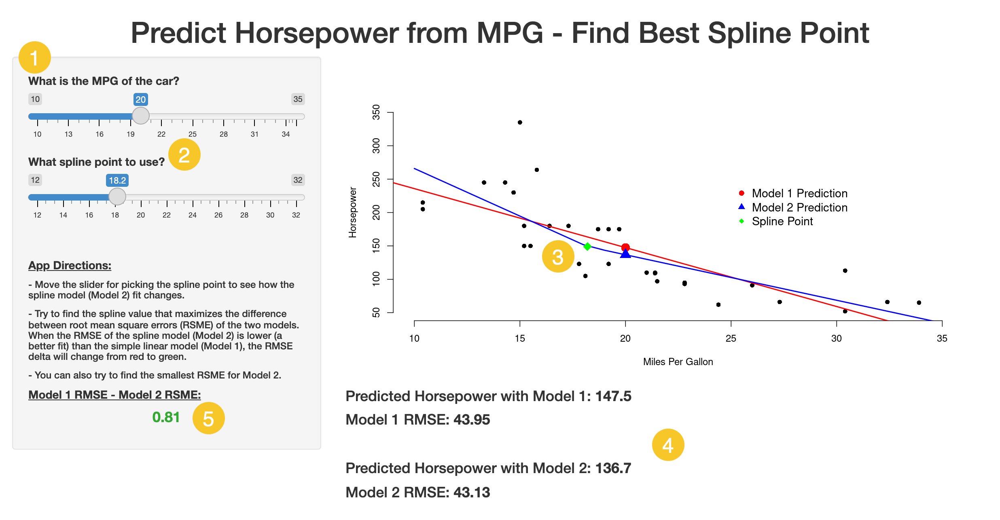

## Background

This presentation is in fulfillment of the Developing Data Products Project to develop and publish an application using the Shiny package and to 'pitch' the app in a Slidify presentation.

The app can be found on the ShinyApps site at: [week_04_project](https://sxibbs-david-erhart.shinyapps.io/week_04_project/?_ga=2.137299504.1642642637.1639430115-1723247215.1639267126)

The application must include the following:
* Some form of input (widget: textbox, radio button, checkbox, ...)
* Some operation on the ui input in sever.R
* Some reactive output displayed as a result of server calculations
* Enough documentation so that a novice user could use your application
  

--- 

## Motivation & Concept

I was interested in extending the 'Reactive Horsepower' example that was covered in Week 2. Specifically, I wanted to add the option to pick different spline points and compare the spline model fit with the simple linear model.

In order to assess the model fit (for both models), I used the root mean square error (RMSE) metric from the lm summary method.

By moving the spline point slider back and forth, the user can visually see the change in the piece-wise fit to the mtcars hp & mpg data.


---

## Mechanics

1 The user can pick the mpg value they want for an hp prediction

2 The user can pick different spline points (a green diamond on the plot)

3 The plot dynamically updates with changes in either slider input

4 The model prediction and the model RMSE values are presented

5 The difference between the two RMSEs is shown (red when Model 1 is a poorer fit)

```{r, echo = FALSE, out.width='50%', fig.align='center'}

```

---

## Future Embellishments

In it's current form the app is pretty simple. If I had more time to spend improving it I would try the following:

* Add the option to pick the number of spline points from a menu
  + This would involve creating individual sliders for each point
  + The sliders would have to adjust to ranges reflecting the locations of the points
  
* Add a gauge in the side panel to show the delta between the RSMEs of Model 1 and Model 2
  + This would involve using Shiny Dashboard to get that functionality

* Output the minimum RSME for each model so the user can tell when they have found the best fit

